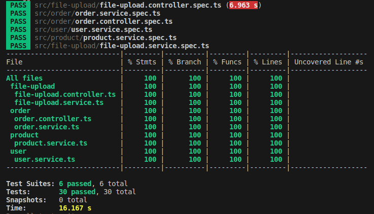

# **Teste para desenvolvedor Back-end - Magalu**

Essa API é um teste para seleção na empresa Magalu.

O desafio consiste na criação de 3 endpoints:

1. 
  - Criar um endpoint para receber um arquivo de texto
  - Processar este arquivo e persistir seus dados de forma normalizada no banco de dados
  - Devolver resposta com:
    - produtos agrupados por pedidos;
    - pedidos ordenados por id e agrupados por usuários ;
    - e usuários ordenados por id levando em conta melhor performance de processamento.

2. 
  - Criar endpoint para buscar pedido por ID

3. 
  - Criar endpoint para buscar pedido por intervalo de data

O projeto foi escrito na linguagem Typescript, utilizando o framework Nest.js. </br>
Foram utilizados princípios SOLID com enfoque em 100% de cobertura de testes unitários com Jest.



<br /><br />

> ## Bibliotecas e Ferramentas

* NPM
* Typescript
* Nest.js
* Git
* Docker
* Jest
* TypeORM
* PG (Postgres)
* Lint Staged
* Eslint

> ## Features de Testes

* Cobertura em 100% de Testes Unitários
* Mocks
* Stubs
* Spies

## **Configurações iniciais**

Node 18.x

1. Instalação dos pacotes
```
yarn
```

2. Execute o docker para iniciar os serviços necessários como banco de dados (Postgres)
```
docker-compose up -d
```

3. Execute a aplicação com:
```
yarn start:dev
```

4. Para executar testes unitários:
```
yarn test:ci
```
## **Endpoints**

A collection de requisições para ser importada pelo Insomnia pode ser encontrada no path `doc/collections/Insomnia_2024-04-29.json` </br></br>

1. **Fazer upload do arquivo de texto** </br>
```
curl --request POST \
  --url http://localhost:3000/file-upload/upload \
  --header 'content-type: multipart/form-data' \
  --form file=@/mnt/arquivos/trabalho/magalu/magalu-test/doc/desafio-tecnico/data_1.txt
```
</br></br>

2. **Buscar por id do pedido** </br>
```
curl --request GET \
  --url 'http://localhost:3000/order/08038229-ffe4-4439-8a5a-b6a719a5f855?=' \
  --header 'User-Agent: insomnia/9.0.0'
```
</br></br>

3. **Buscar por intervalo de data do pedido** </br>
```
curl --request GET \
  --url 'http://localhost:3000/order?startDate=2021-09-10&endDate=2021-10-10' \
  --header 'User-Agent: insomnia/9.0.0'
```
</br></br>
